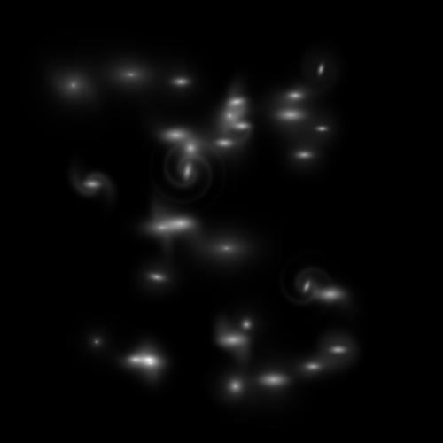

# GalaxyMusic

Making galaxies with music and hopefully... eventually... music with galaxies.



This image brought to you by the Brown University Alma Mater.

## Overview

GalaxyMusic is the prototype of a Python library that allows you to create visualizations of 
galaxies as informed by [GALFIT](https://users.obs.carnegiescience.edu/peng/work/galfit/galfit.html) 
and synchronize them with music. The library provides tools to generate animations, process images, 
and integrate audio to create a fun audiovisual experience.

## Features

- Generate galaxy mosaics and animations.
- Integrate music with galaxy visualizations.
- Support for parallel processing to speed up image processing tasks.

## Installation


To install GalaxyMusic, clone the repository and install the required dependencies:


```bash

git clone https://github.com/matthewportman/galaxymusic.git

cd galaxymusic

pip install -r requirements.txt
```

`galaxymusic` also needs `ffmpeg` to generate the final mosaic video.
## Usage

[//]: # (### Generating Galaxy Animations)

[//]: # ()
[//]: # (To generate a galaxy animation, use the `generate_animation` function:)

[//]: # ()
[//]: # (```python)

[//]: # (from galaxymusic import generate_animation)

[//]: # ()
[//]: # (# Example usage)

[//]: # (all_images = [...]  # List of numpy arrays representing galaxy images)

[//]: # (time_step = 0.5  # Time step in seconds)

[//]: # ()
[//]: # (generate_animation&#40;all_images, time_step, filename="mosaic.gif"&#41;)

[//]: # (```)

### Creating a Galaxy Mosaic

To create a galaxy mosaic, open the `galaxy_music.ipynb` notebook in a jupyter
installation of your choice. Modify the hyperparameter `music_filename` to select
the music file you would like to process. Then run the notebook to generate a galaxy
mosaic synchronized and informed by the music.

For more details, see the documentation inside `galaxy_music.ipynb`.

Note, galaxymusic contains some utilization of the galfitlib library, which is not
yet ready for distribution. A local copy is included in the repository. A few of the modules
used in `galaxy_music.ipynb` can be found there in the `utilities/music` directory. 
Any additional utility used throughout is from functionality included in the library itself.

[//]: # (### Adding Galaxies to a Mosaic)

[//]: # (To create a galaxy mosaic, use the `add_galaxy_to_mosaic` function:)

[//]: # ()
[//]: # (```python)

[//]: # (from galaxymusic import add_galaxy_to_mosaic)

[//]: # ()
[//]: # (# Example usage)

[//]: # (frame = 1)

[//]: # (all_images = [...]  # List of numpy arrays representing galaxy images)

[//]: # (lengthening_factor = 3)

[//]: # (plot_image = None  # Initialize plot_image as needed)

[//]: # ()
[//]: # (add_galaxy_to_mosaic&#40;frame, all_images, lengthening_factor, plot_image, save=True, filename="mosaic.jpg"&#41;)

[//]: # (```)

[//]: # (### Integrating Music)

[//]: # ()
[//]: # (To integrate music with your galaxy visualizations, use the `ffmpeg` command to combine images and audio:)

[//]: # ()
[//]: # (```python)

[//]: # (from subprocess import run as sp)

[//]: # ()
[//]: # (# Example usage)

[//]: # (mosaic_image_prefix = "path/to/mosaic")

[//]: # (music_filename = "path/to/music.mp3")

[//]: # (output_video = "path/to/output_video.mp4")

[//]: # ()
[//]: # (ffmpeg_command = f"ffmpeg -framerate 4 -i {mosaic_image_prefix}_%d.jpg -i {music_filename} {output_video}")

[//]: # (process = sp&#40;ffmpeg_command, shell=True&#41;)

[//]: # (```)

## Contributing

Contributions are welcome! Please fork the repository and submit a pull request with your changes.

## License

This project is licensed under the GPL-3.0 license. See the `LICENSE` file for more details.

## Contact

For any questions or inquiries, please contact [portmanm@uci.edu](portmanm@uci.edu).

## Acknowledgements
Special thanks to Matthew Hopkins for his help with the FFT/Signal Processing code and 
several others of the original hack day team that helped to inform the initial versions of 
this script. 
